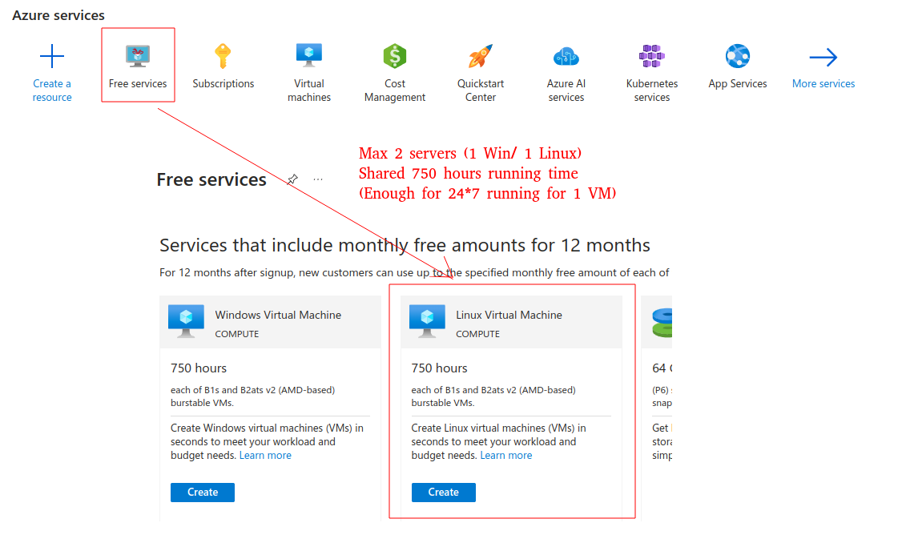
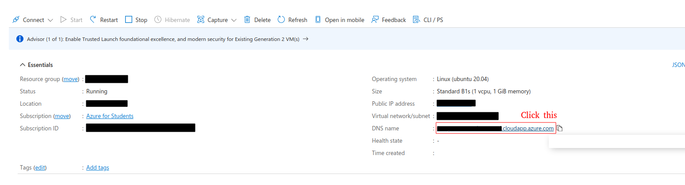
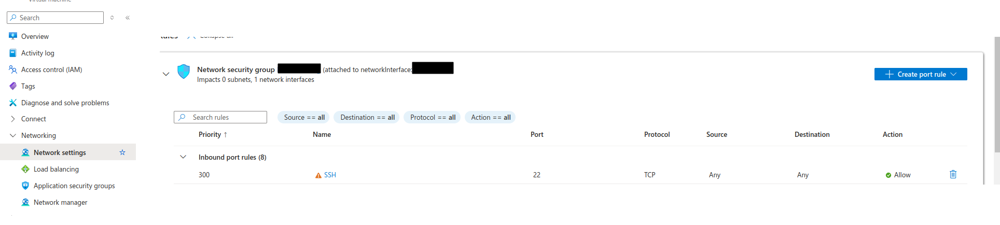

# SSH Penetration Solution for TCD

## 1. Introduction
Some graduate students in TCD may need to access their desktops in the lab remotely. Serval potential solutions are listed and there is no perfect solution for this purpose so far.
| Method| Costs | Works | Pros | Cons |
|---|---|---|---|---|
| Direct SSH | Free  | ✗  | Fast for remove coding | BANDED by TCD |
|RestDesk | Free  |  ✗| Free | Both official & private servers are BANED by TCD |
| ToDesk   | ~25Euro+/Y   |  ✓   | Install and enjoy | Terrible performance |

This document provides a simple solution to access the desktops in the lab remotely using SSH. The core idea is:
- Reverse SSH tunneling between the desktop in the lab and an **ACCESSIBLE** server (e.g., Azure).
- **Port forwarding** from prot 22 to another port (e.g., 2222) on the server.

## 2. Prerequisites
- Make sure you have an **ACCESSIBLE** server (e.g., [Azure](https://azure.microsoft.com/en-us/free/students/), free for TCD students) with a public IP address (or a domain name).
- Set up an SSH service on your **DESKTOP** in the lab.

## 3. Azure Server Configuration (Optional)
### 3.1 Create a Virtual Machine
Sign in to the [Azure portal](https://portal.azure.com/), click **Free service** from the 'create a resource' menu, and then click **Linux VM**. 
A 1-core VM with 1GB memory is enough for this purpose. Remember to close the diagnosis function for cost-saving.

The final configuration should look like this:
- 1 core cpu, 1 GB memory
- 64GB disk
- SSH public key authentication (recommended)
- **Dynamic** public IP address

### 3.2 Setup Domain Name
Band domain name to the public IP address of the VM. The Azure provides a free domain name. You can get it in the 'DNS name' section of the VM. 

You can also use your own domain name.

### 3.3 Server Configuration
- Make sure the SSH service is running on the server.
- Open the 'gateway ports' of SSH in the server. With Linux server, edit the SSH configuration file `/etc/ssh/sshd_config`:
  ```shell
  sudo vim /etc/ssh/sshd_config
  ```
  make sure the following line is uncommented:
  ```shell
  GatewayPorts yes
  ```
  Then restart the SSH service:
  ```shell
  sudo systemctl restart sshd
  ```
- Add firewall rules to allow the traffic on the port you want to forward. For example, if you want to forward port 2222, add the following rule:
  ```shell
  sudo ufw allow 22/tcp
  sudo ufw allow 2222
  sudo ufw enable
  ``` 
- Add inbound/outbound rules in the Azure portal to allow the traffic on the port you want to forward.
 

## 4. Desktop (in your lab) Configuration
### 4.1 Opening Reverse SSH Tunneling
Open a reverse SSH tunneling from the desktop to the server. Assume your private key is located at `~.ssh/YOUR_KEY.pem`, the username is `USER`, the domain name is `DOMAIN_NAME`, and the port you want to forward is `2222`. Run the following command on the desktop:
```shell
ssh -i ~/.ssh/YOUR_KEY.pem -R 0.0.0.0:2222:localhost:22 USER@DOMAIN_NAME
```
If everything goes well, you should login to the server. Please keep the terminal open.

Note:
You should set your private key to be read-only by the owner. For Linux, run the following command to set the permission:
```shell
sudo chmod 600 ~/.ssh/YOUR_KEY.pem
```
For Windows, it may be a little bit tricky according to my experience. You can find many tutorials on the internet.:P

### 4.2 Port Forwarding Checking
Check if the port forwarding is working. Run the following command on the server:
```shell
sudo netstat -tuln | grep 2222
```
if you see the following output, the port forwarding is working:
```shell
tcp        0      0 0.0.0.0:2222         0.0.0.0:*               LISTEN     
tcp6       0      0 :::2222              :::*                    LISTEN
```

### 4.3 Access the Desktop Remotely
Now you can access the desktop remotely. Assume the domain name of the Azure server is `DOMAIN_NAME`, the username of your **lab desktop** is `LOCAL_USER`, and the port you want to forward is `2222`. Run the following command on your local machine:
```shell
ssh -p 2222 LOCAL_USER@DOMAIN_NAME
```
If connected successfully, you should input the password of your **lab desktop** and login to the desktop.

If you have set up the public key authentication in your lab desktop, you add `-i' option to specify the private key.

### 4.4 Automation
You can write a script to automate the process. For example, create a file `tunnel.sh` with the following content:
```shell
#!/bin/bash

# configs
REMOTE_USER="tcd_user"                    # Cloud server user name
REMOTE_HOST="tcd_user.serverlocation.cloudapp.azure.com"       # domain name OR ip
REMOTE_PORT="2222"                   # listen port
LOCAL_PORT="22"                       # ssh port of your desktop in TCD
PRIVATE_KEY="~/.ssh/my_key.pem"  # your private key of the CLOUD SERVER
WAITING_TIME_SECOND="600"

while true; do
    echo "Try SSH to the server..."
    
    # Establish ssh
    ssh -i "$PRIVATE_KEY" -R 0.0.0.0:"$REMOTE_PORT:localhost:$LOCAL_PORT" "$REMOTE_USER@$REMOTE_HOST"
      
    # Waiting and retry
    sleep WAITING_TIME_SECOND
done
```
## 5. SSH from Lab to Remote Servers
Sometimes you may need to SSH from your lab desktop to other servers (at your home, for example). You can try following the same steps to establish a reverse SSH tunneling from the lab desktop to the server at home. Then you can SSH from the lab desktop to the server at home.

I have not tried this yet. If you have any questions or suggestions, please feel free to contact me. I am happy to help you.
